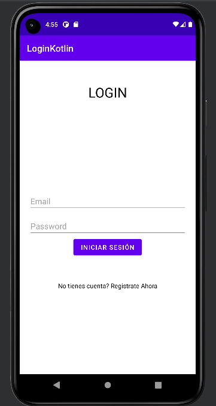

# Login de Usuario con Kotlin
### Integrantes: 
- Armas Alejandro
- Guallichico Nataly

### Acerca del proyecto

El siguiente proyecto consiste en la elaboración de un Login de usuario conectado a firebase realtime database, realizado en kotlin, en donde consta con un login de inicio de sesión, un apartado para ingresar datos para el registro de usuarios y la parte del home de bienvenida, en donde los datos ingresados en el registro seran almacenados en una base de datos en Firebase

  
