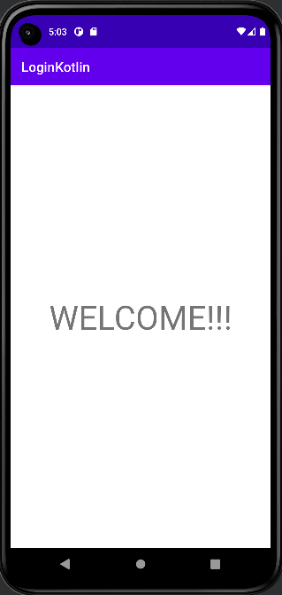
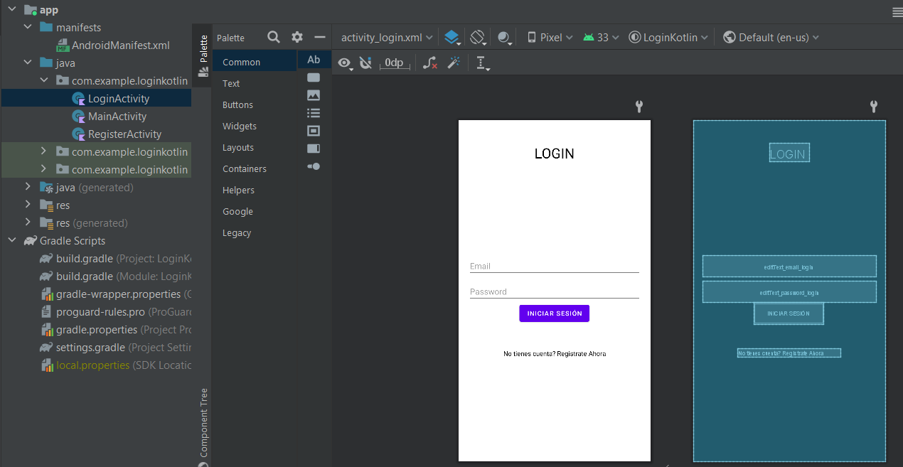
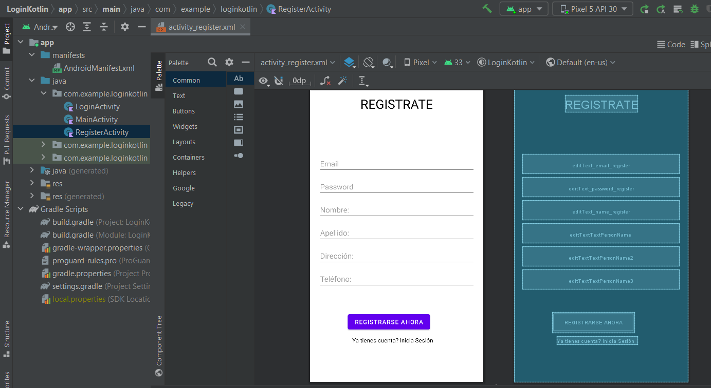
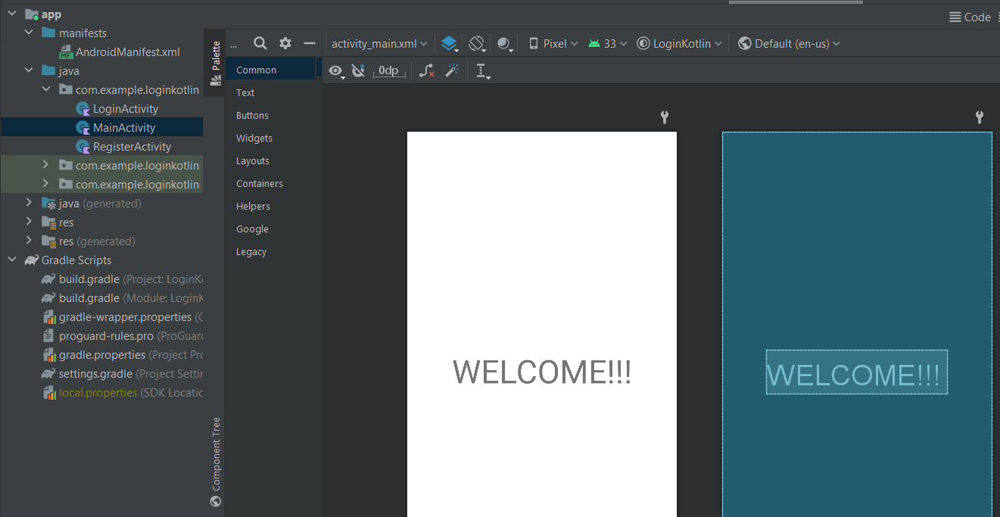
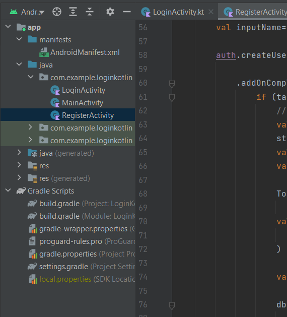

# Login de Usuario con Kotlin
### Integrantes: 
- Armas Alejandro
- Guallichico Nataly

### Acerca del proyecto

El siguiente proyecto consiste en la elaboración de un Login de usuario conectado a firebase realtime database, realizado en kotlin, en donde consta con un login de inicio de sesión, un apartado para ingresar datos para el registro de usuarios y la parte del home de bienvenida, en donde los datos ingresados en el registro seran almacenados en una base de datos en Firebase.

### Login de Usuario (Inicio de Sesión)

  

### Registro de Usuario

# Funcionalidad 

Para verificar que los datos ingresados se guarden en nuestra realtime data base, registraremoso un nuevo usuario

### Ingreso éxitoso

# Verificación de datos en Firebase

### Usuarios

Los usuario registrados se encuentran alemacenados en firebase.

### Información de los Usuarios

La información  de los usuario registrados se encuentran alemacenados en nuestra base de datos.

# Código del proyecto 

### Diseño

El diseño de la implementacion se lo realizo mediante la funcion drag an drop

- Diseño de Login de Usuario

- Diseño de Registro de Usuario

- Diseño de Bienvenida

### Funcionalidad

El código de la funcionalidad implementada para este proyecto se encuentra en la ruta <em>app/java/com.exaple.loginkotlin</em> 

